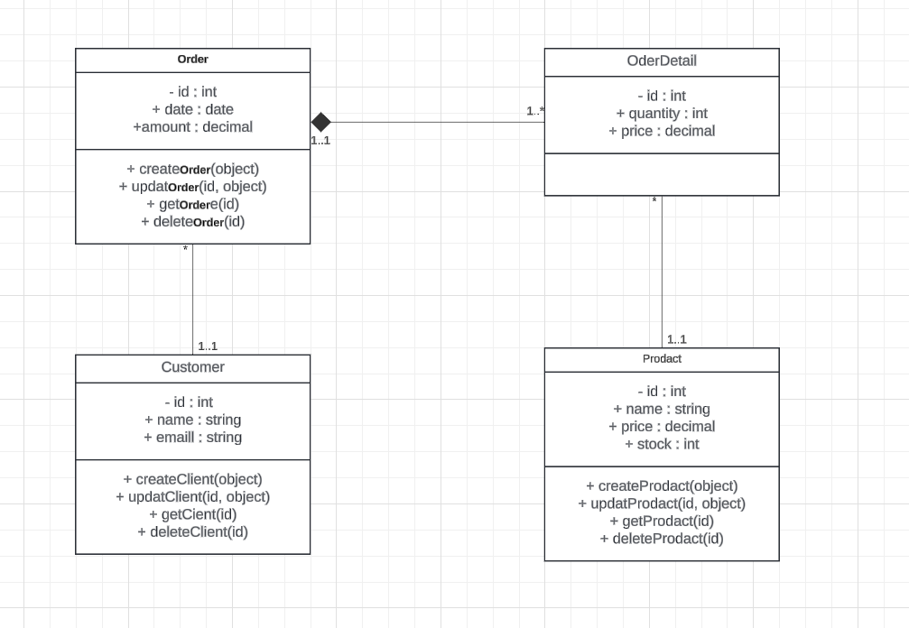

# Projet de Gestion de commande

Ce projet développe une application de gestion des commandes avec Express. Il offre des fonctionnalités pour créer, lire, mettre à jour et supprimer des clients ainsi que des produits.


## Prérequis

- Node.js

## Installation

Clonez le projet et installez les dépendances :

```bash
git clone https://github.com/AbderahmaneThimbo/Express-gestion-commande.git
cd Express-gestion-commande
npm install
```

## Démarrer le projet

```bash
npm start
```

## UML

